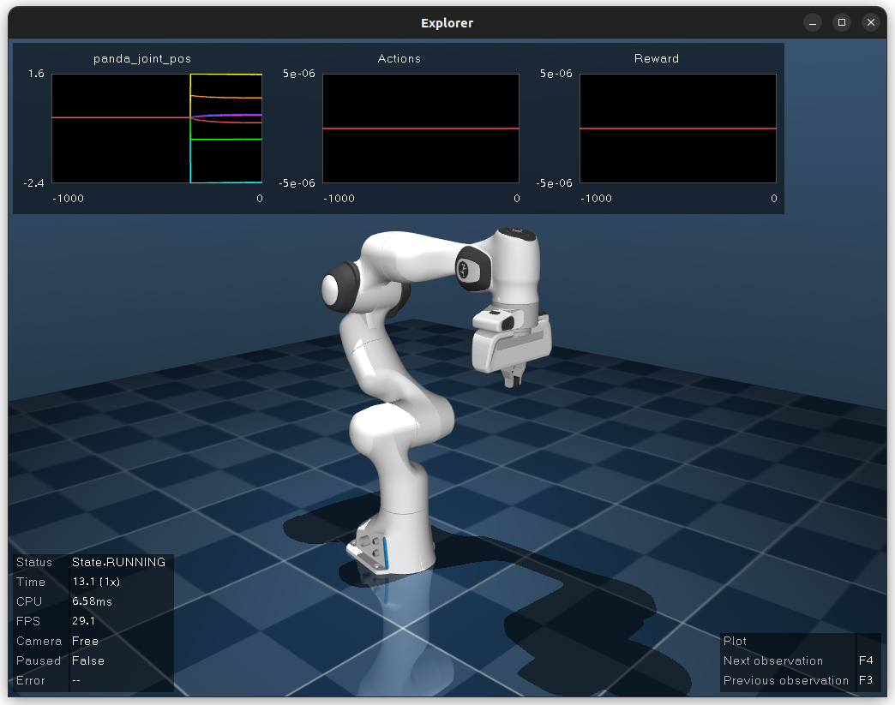
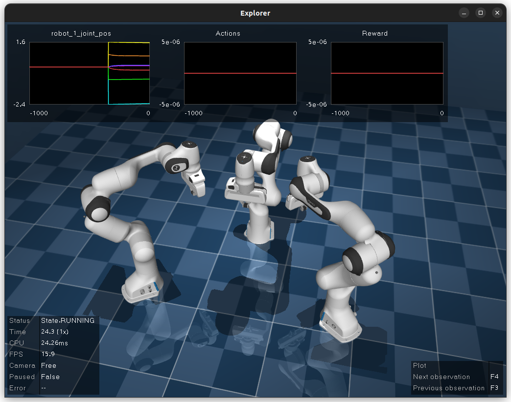
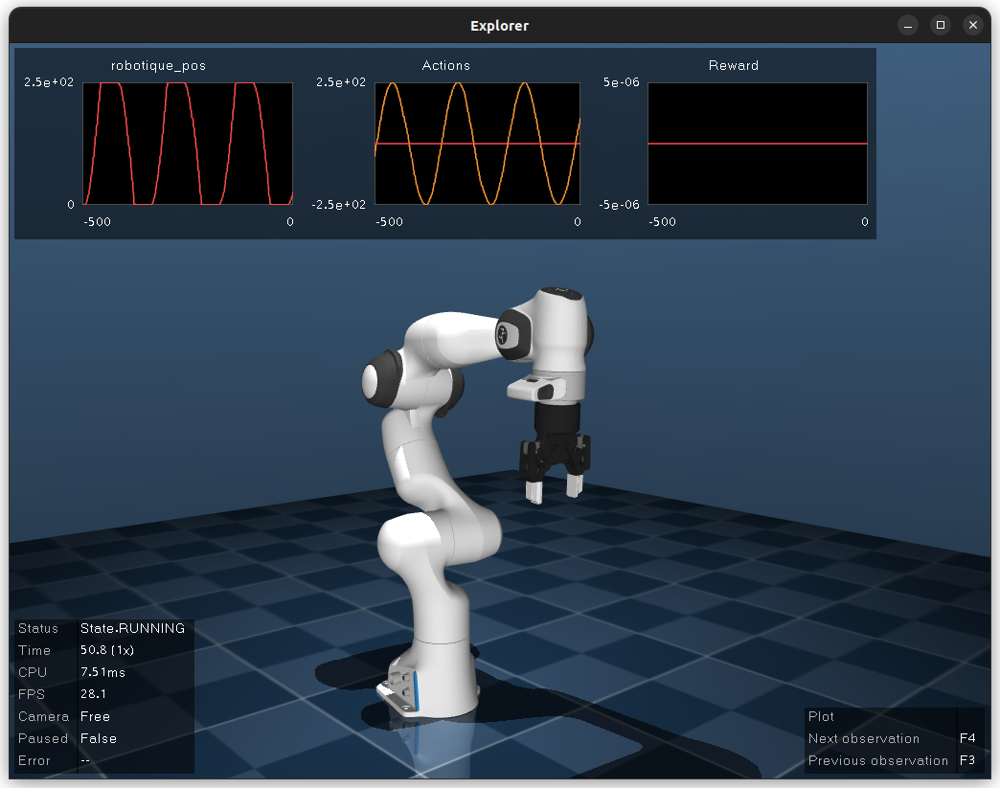

Tutorial
========

Introduction
------------

This tutorial focuses on functionality provided by ``dm_robotics_panda``.
Although the examples provide a fully implemented starting point, for more details
on how to prepare reinforcement learning environments please refer to the material
provided with the `dm_robotics <https://github.com/google-deepmind/dm_robotics>`_
and by extension `dm_control <https://github.com/google-deepmind/dm_control>`_ repositories.

.. note::
    This section is implemented in ``examples/minimal_working_example.py``.
    Run this file or any of the examples with the ``--gui`` option or ``-g``
    to run the simulation in the visualization app.

A minimum working example consists of a robot configuration, an environment,
an agent that controls the robot, and a method to run the environment.
:py:class:`dm_robotics.panda.environment.PandaEnvironment` is the main point of interaction.
This class populates the environment with Panda robots configured using
:py:class:`dm_robotics.panda.parameters.RobotParams`.

.. code:: python

   robot_params = params.RobotParams()
   panda_env = environment.PandaEnvironment(robot_params)

   with panda_env.build_task_environment() as env:
     ...

The MoMa task environment returned by ``build_task_environment()`` can then be executed
by :py:func:`dm_robotics.panda.run_loop.run` or visualized with 
:py:class:`dm_robotics.panda.utils.ApplicationWithPlot`. The visualization app
is a convenient tool to debug environments or evaluate agents and
includes live plots of observations, actions, and rewards.

Finally, we require an agent that provides actions in the form of NumPy arrays
according to the environment's specification. A minimal agent provides a ``step``
function that receives a timestep and returns an action.

.. code:: python

   class Agent:

     def __init__(self, spec: specs.BoundedArray) -> None:
       self._spec = spec

     def step(self, timestep: dm_env.TimeStep) -> np.ndarray:
       action = np.zeros(shape=self._spec.shape, dtype=self._spec.dtype)
       return action

The shape of the action will depend on the number of configured robots and chosen actuation mode.

Motion Control
--------------

By default the robots use a Cartesian velocity motion
`controller <https://github.com/google-deepmind/dm_robotics/blob/main/cpp/controllers/README.md>`_
from ``dm_robotics`` that uses quadratic programming to solve a stack-of-tasks optimization problem.
The actuation mode is configured as part of the robot parameters as defined in
:py:class:`dm_robotics.panda.arm_constants.Actuation`.
The motion of the Panda robot is controlled through the agent interface.
Agents need to provide a ``step()`` function that accepts a ``dm_env`` timestep and returns
an action (control signal) in the form of a NumPy array.
 

.. note::
    The examples in this section support optional hardware in the loop (HIL) mode. You can run the examples
    with HIL by executing the files with the ``--robot-ip`` option set to the hostname or IP address
    of a robot connected to the host computer. This option can be combined with ``--gui`` for visualization.
    Beware that the robot will try to move into the initial pose of the simulation. You can set the initial
    position by setting ``joint_positions`` in the robot parameters.

    When running any of the examples,
    the action specification (shape) of the configured actuation mode along with the observation
    and reward specification will be printed in the terminal for convenience.

Joint
^^^^^

Joint velocity control is activated as part of the robot configuration.

.. code:: python

   robot_params = params.RobotParams(actuation=arm_constants.Actuation.JOINT_VELOCITY)

The action interface is a 7-vector where each component controls the corresponding joint's velocity.
If the Panda gripper is used (default behavior) there is one additional component to control grasping.

.. code:: python

   class Agent:
   """This agent produces a sinusoidal joint movement."""

     def __init__(self, spec: specs.BoundedArray) -> None:
       self._spec = spec

     def step(self, timestep: dm_env.TimeStep) -> np.ndarray:
       """Computes sinusoidal joint velocities."""
       time = timestep.observation['time'][0]
       action = 0.1 * np.sin(
           np.ones(shape=self._spec.shape, dtype=self._spec.dtype) * time)
       action[7] = 0  # gripper action
       return action

   agent = Agent(env.action_spec())

Where ``env.action_spec()`` is the MoMa subtask environment returned by ``build_task_environment()``
that is used to retrieve the environment's action specification. This example will result in a small
periodic motion and is implemented in ``examples/motion_joint.py``. See below for a video of the example
running with HIL and the visualizaiton app.

.. youtube:: C14HlT1Scdo

Cartesian
^^^^^^^^^

Cartesian velocity control is the default behavior but can also be configured explicitly
as part of a robot's configuration.

.. code:: python

   robot_params = params.RobotParams(actuation=arm_constants.Actuation.CARTESIAN_VELOCITY)

The effector's (controller's) action space consists of a 6-vector where the first three indices
correspond to the desired end-effector velocity along the control frame's x-, y-, and z-axis. The
latter three indices define the angular velocities respectively. If no control frame is configured,
the world frame is used as a reference.

.. code:: python

   class Agent:
     """The agent produces a trajectory tracing the path of an eight
     in the x/y control frame of the robot using end-effector velocities.
     """

     def __init__(self, spec: specs.BoundedArray) -> None:
       self._spec = spec

     def step(self, timestep: dm_env.TimeStep) -> np.ndarray:
       """Computes velocities in the x/y plane parameterized in time."""
       time = timestep.observation['time'][0]
       r = 0.1
       vel_x = r * math.cos(time)  # Derivative of x = sin(t)
       vel_y = r * ((math.cos(time) * math.cos(time)) -
                   (math.sin(time) * math.sin(time)))
       action = np.zeros(shape=self._spec.shape, dtype=self._spec.dtype)
       # The action space of the Cartesian 6D effector corresponds
       # to the linear and angular velocities in x, y and z directions
       # respectively
       action[0] = vel_x
       action[1] = vel_y
       return action

This agent computes velocities parameterized in simulation time to produce a path
that roughly traces the shape of an eight in the x/y plane.
Note that this agent does not implement a trajectory follower but rather applies
end-effector velocities in an open loop manner. As such the path may drift over time.
In practice we would expect more sophisticated (learned) agents to take the current
observation (state) into account.

The video below demonstrates the example implemented in ``examples/motion_cartesian.py``
with HIL and visualization.

.. youtube:: vYvdr7iGCv4

Gripper
^^^^^^^

The Panda's gripper (officially called the Franka Hand) is not easy to model as it doesn't feature a
real-time control interface and is affected by hysteresis. Because of this, the gripper's MoMa effector
features only a binary action space, allowing for an outward and an inner grasp corresponding to action
values 0 and 1 respectively. Internally the gripper's effector maps actions to 0 if < 0.5 and 1 otherwise.
The gripper is attached by default, however this behavior can be deactivated or explicitly set in the
robot configuration.

.. code:: python

   robot_params = params.RobotParams(has_hand=True)

The example implemented in ``examples/gripper.py`` includes a simple agent that generates random actions
to illustrate the gripper's behavior.

.. code:: python

   class Agent:
     """This agent controls the gripper with random actions."""

     def __init__(self, spec: specs.BoundedArray) -> None:
       self._spec = spec

     def step(self, timestep: dm_env.TimeStep) -> np.ndarray:
       """Every timestep, a new random gripper action is generated
       that would result in either an outward or inward grasp.
       However, the gripper only moves if 1) it is not already moving
       and 2) the new command is different from the last.
       Therefore this agent will effectively result in continuously
       opening and closing the gripper as quickly as possible.
       """
       del timestep
       action = np.zeros(shape=self._spec.shape, dtype=self._spec.dtype)
       action[6] = np.random.rand()
       return action

Note how, in the video below, the grasp adapts to the size of an object placed between
the gripper's fingers. This can also be observed in the gripper's width observation plot.

.. youtube:: h3P0HBPF3NU

Haptic Interaction
------------------

The haptic actuation mode is a special mode that renders constraint forces from
the simulation on the real robot when used with HIL. This allows users to haptically
interact with the simulation through the robot. Haptic mode is activated through the
robot configuration. Additional settings include ``joint_damping`` which is usually
set to 0.

.. code:: python

   robot_params = params.RobotParams(robot_ip=args.robot_ip,
                                     actuation=arm_constants.Actuation.HAPTIC,
                                     joint_damping=np.zeros(7))
   panda_env = environment.PandaEnvironment(robot_params,
                                            arena,
                                            control_timestep=0.01)

Setting the MoMa control timestep to a small value will improve quality and stability of the
physical interaction. The example implemented in ``examples/haptics.py`` loads a simple scene
from an MJCF file that includes a static cube.

.. code:: python

   # Load environment from an MJCF file.
   XML_PATH = os.path.join(os.path.dirname(__file__), 'assets', 'haptics.xml')
   arena = composer.Arena(xml_path=XML_PATH)

The video below demonstrates haptic interaction mode. Note that the HIL connection feeds
measured external forces back into the simulation which can be accessed as observations.

.. youtube:: hn42udf0uKc

Multiple Robots
---------------

Populating an environment with multiple Panda robots is done by simply
creating multiple robot configurations and using them to instantiate
:py:class:`dm_robotics.panda.environment.PandaEnvironment`.

.. code:: python

   robot_1 = params.RobotParams(name='robot_1', pose=[0, 0, 0, 0, 0, 0])
   robot_2 = params.RobotParams(name='robot_2',
                                pose=[.5, -.5, 0, 0, 0, np.pi * 3 / 4])
   robot_3 = params.RobotParams(name='robot_3',
                                pose=[.5, .5, 0, 0, 0, np.pi * 5 / 4])
   panda_env = environment.PandaEnvironment([robot_1, robot_2, robot_3])

The ``pose`` parameter is a 6-vector that describes a transform (linear displacement and Euler angles)
to a robot's base. Without this configuration the three robots would spawn in same location.
A minimal example of multiple robot is implemented in ``examples/multiple_robots.py``
and shown below.

In a more sophisticated application we can build a simple robot with a branching kinematic structure.
For this purpose we modeled a stationary robot with a hinge joint around its main axis. The MJCF file
includes ``site`` elements as part of the robot's body that define the attachment as well as control
frames.

.. code:: python

   XML_PATH = os.path.join(os.path.dirname(__file__), 'assets', 'two_arm.xml')
   arena = composer.Arena(xml_path=XML_PATH)
   left_frame = arena.mjcf_model.find('site', 'left')
   right_frame = arena.mjcf_model.find('site', 'right')
   control_frame = arena.mjcf_model.find('site', 'control')

Using an attachment frame is different from using the ``pose`` parameter in so far as the
attached Panda robot will be a child of the ``body`` containing the attachment site. The
control frame is the reference frame used by the Cartesian velocity motion controller.
It is also used to compute pose, velocity and wrench observations in control frame.

.. code:: python

   left = params.RobotParams(attach_site=left_frame,
                             name='left',
                             control_frame=control_frame)
   right = params.RobotParams(attach_site=right_frame,
                              name='right',
                              control_frame=control_frame)
   env_params = params.EnvirontmentParameters(mjcf_root=arena)
   panda_env = environment.PandaEnvironment([left, right], arena)

By using the same control frame attached to the robot's body for both arms, the Cartesian motion of the
arms is invariant to the rotation of the robot (i.e. the reference frame rotates with the main body).
This can be seen in ``examples/two_arm_robot.py``. In this example the agent produces a sinusoidal velocity
action along the x-axis for both arms. In the video below, the user can be seen to interact with the robot
body to rotate it, while the motion remains invariant.

.. youtube:: cAUjkhrBmN4

Custom Gripper
--------------

You can use the Panda model with any gripper that implements the ``dm_robotics`` gripper interface.
The example implemented in ``examples/custom_gripper.py`` uses a model of the `Robotiq 2-finger 85`
gripper, sensor and effector to attach to a Panda robot. This is again done using the robot configuration.

.. code:: python

   gripper = robotiq_2f85.Robotiq2F85()
   gripper_params = params.GripperParams(
       model=gripper,
       effector=default_gripper_effector.DefaultGripperEffector(
           gripper, 'robotique'),
       sensors=[
           robotiq_gripper_sensor.RobotiqGripperSensor(gripper, 'robotique')
       ])
   robot_params = params.RobotParams(gripper=gripper_params, has_hand=False)

Gripper parameters above include model, sensors and an effector that are part of the robot configuration.
You also need to set ``has_hand`` to `False`, otherwise the Panda gripper will be used. The Robotiq gripper
can be controlled continuously and the example uses a simple agent to apply a sinusoidal action to control
the gripper. The resulting model is pictured below.

RL Environment
--------------

This section briefly introduces some of the key concepts of designing a reinforcement learning
environment in the ``dm_robotics`` framework and illustrates how to integrate these with
``dm_robotics_panda``. This section is implemented in ``examples/rl_environment.py``.

Props
^^^^^

Props are dynamic objects in the environment that can be manipulated. They are based on MuJoCo
elements that are built by the prop's class and attached to the scene.

.. code:: python

   class Ball(prop.Prop):
     """Simple ball prop that consists of a MuJoco sphere geom."""

     def _build(self, *args, **kwargs):
       del args, kwargs
       mjcf_root = mjcf.RootElement()
       # Props need to contain a body called prop_root
       body = mjcf_root.worldbody.add('body', name='prop_root')
       body.add('geom',
                type='sphere',
                size=[0.04],
                solref=[0.01, 0.5],
                mass=1,
                rgba=(1, 0, 0, 1))
       super()._build('ball', mjcf_root)

The code above defines a new prop class. A minimal prop implementation needs to overwrite the
``_build`` function to construct an MJCF root element that has at least a body called ``prop_root``
attached. The positional and keyword arguments passed to the ``_build`` function are the same
as the constructor's, but it's not recommended to overwrite the constructor itself. To attach
props, we simply instantiate them and add them to :py:class:`dm_robotics.panda.environment.PandaEnvironment`.

.. code:: python

   ball = Ball()
   props = [ball]
   for i in range(10):
     props.append(rgb_object.RandomRgbObjectProp(color=(.5, .5, .5, 1)))

   panda_env.add_props(props)

In the code snippet above, in addition to the ball, we add 10 random props from the RGB object family
that is part of ``dm_robotics.manipulation``.

Cameras
^^^^^^^

Cameras are modelled in MuJoCo directly. This can be done in an MJCF file as part of the environment
description and loaded from file as an arena. Alternatively, camera elements can be added through code.
The latter allows us to attach cameras to the robots as well.

.. code:: python

   # Use the robot added by PandaEnvironment to add a MuJoCo camera element to the gripper.
   panda_env.robots[robot_params.name].gripper.tool_center_point.parent.add(
       'camera',
       pos=(.1, 0, -.1),
       euler=(np.pi, 0, -np.pi / 2),
       fovy=90,
       name='wrist_camera')

The camera element is attached to the parent body of the tool center point as cameras cannot
be child elements of site elements. The pose relative to the parent (in this case the wrist)
is chosen so the camera looks along the end-effector. We can use this camera in the visualization
app, to render out images from code, or to add images to the observation.

Reward and Observation
^^^^^^^^^^^^^^^^^^^^^^

An environment's reward and observation are conferred as part of the timestep.
In the ``dm_robotics`` framework the timestep may be modified by timestep preprocessors
to add or modify rewards and observations. There are many timestep preprocessors as part
of the framework that cover common applications. While timestep preprocessors can add
arbitrary observations to a timestep, MoMa sensors may also add observations related to
MuJoCo model elements such as cameras or props.

.. code:: python

   # Extra camera sensor that adds camera observations including rendered images.
   cam_sensor = camera_sensor.CameraImageSensor(
       panda_env.robots[robot_params.name].gripper.mjcf_model.find(
           'camera', 'wrist_camera'), camera_sensor.CameraConfig(has_depth=True),
       'wrist_cam')

   # Extra prop sensor to add ball pose to observation.
   goal_sensor = prop_pose_sensor.PropPoseSensor(ball, 'goal')

   panda_env.add_extra_sensors([cam_sensor, goal_sensor])

We make use of MoMa sensors to add camera and prop observations to the timestep. The camera sensor
takes a camera element and configuration and adds rendered images as well as the camera's instrinsic
parameters with the prefix ``wrist_cam`` to the observation. Similarly the prop sensor takes a prop
and adds a pose observation with the prefix ``goal``.

Keep in mind that we used MoMa sensors to add fitting observations for convenience. You are free to
implement your own preprocessors to manipulate the timestep as you see fit. Next we will make use of
predefined timestep preprocessors to add a reward.

.. code:: python

   def goal_reward(observation: spec_utils.ObservationValue):
     """Computes a normalized reward based on distance between end-effector and goal."""
     goal_distance = np.linalg.norm(observation['goal_pose'][:3] -
                                    observation['panda_tcp_pos'])
     return np.clip(1.0 - goal_distance, 0, 1)

   reward = rewards.ComputeReward(goal_reward)

   panda_env.add_timestep_preprocessors([reward])

``ComputeReward`` is a timestep preprocessor that computes a reward based on a callable that takes
an observation and returns a scalar which is added to the timestep. The callable ``goal_reward``
computes a reward based on the distance between the robot's end-effector and the ball's pose
observation which we added above.

Domain Randomization
^^^^^^^^^^^^^^^^^^^^

The ``dm_robotics`` framework includes several tools for domain randomization.
These can be implemented as scene and entity initializers. The former is executed
before the model is compiled and the latter afterwards. As such, scene initializers
can be used to change the MJCF itself and entity initializers are used to change the
initial state of the model.

.. note::

   While your are free to implement your own initializers by extending
   :py:class:`dm_robotics.moma.base_task.SceneInitializer` and
   :py:class:`dm_robotics.moma.entity_initializer.base_initializer.Initializer`.
   In this section we demonstrate the principle by using existing initializers.

.. code:: python

   initialize_props = entity_initializer.prop_initializer.PropPlacer(
       props,
       position=distributions.Uniform(-.5, .5),
       quaternion=rotations.UniformQuaternion())

The prop placer is an entity initializer that places multiple props around the environment.
The initializer takes variation objects to determine the Cartesian position and orientation
of the props. In the example above we use uniform distributions that are sampled by the
initializer to randomly place the props. Additionally, the initializer places the props in
a way that they do not collide with the environment.

.. code:: python

   # Uniform distribution of 6D poses within the given bounds.
   gripper_pose_dist = pose_distribution.UniformPoseDistribution(
       min_pose_bounds=np.array(
           [0.5, -0.3, 0.7, .75 * np.pi, -.25 * np.pi, -.25 * np.pi]),
       max_pose_bounds=np.array(
           [0.1, 0.3, 0.1, 1.25 * np.pi, .25 * np.pi / 2, .25 * np.pi]))
   # The pose initializer uses the robot arm's position_gripper function
   # to set the end-effector pose from the distribution above.
   initialize_arm = entity_initializer.PoseInitializer(
       panda_env.robots[robot_params.name].position_gripper,
       gripper_pose_dist.sample_pose)

The pose initializer sets the pose of a single entity by first calling a sampler callable to
retrieve a pose and then a second callable to set the pose. We can make use of this to sample
random Cartesian 6D poses within bounds from ``UniformPoseDistribution`` and then apply those
poses to the end-effector by using :py:func:`dm_robotics.panda.arm.Arm.position_gripper` to
position the arm accordingly with inverse kinematics.

Finally, the example is demonstrated in the video below. Note that you can reset the episode
in the visualization app by pressing `backspace`. For more information on how to interact with
the app Press `F1` to view a help screen.

.. youtube:: Ivsn5uA3xYE
